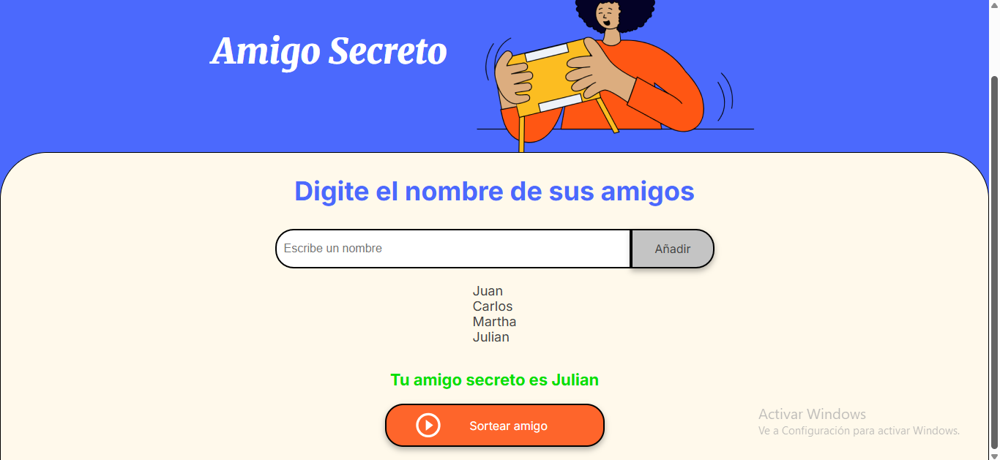

# 🎁 Sorteo de Amigo Secreto

Este proyecto fue desarrollado como parte del primer challenge del programa [Oracle Next Education - ONE](https://www.oracle.com/lad/education/oracle-next-education/) en colaboración con [Alura LATAM](https://www.aluracursos.com/).

## 📌 Descripción

La aplicación permite realizar un sorteo de **amigo secreto** de manera sencilla y visual, evitando que una persona se asigne a sí misma.

Está desarrollado con:

- ✅ HTML
- ✅ CSS
- ✅ JavaScript

## 💻 Funcionalidades

- Ingresar una lista de participantes.
- Sortear automáticamente a cada participante con alguien más (sin repetidos ni autoasignaciones).
- Mostrar los resultados en pantalla.
- Interfaz sencilla y fácil de usar.

## 🚀 Cómo usar

1. Clona este repositorio:
   ```bash
   git clone https://github.com/tuusuario/nombre-del-repo.git

2. Abre el archivo index.html en tu navegador.

3. Agrega los nombres y presiona el botón para hacer el sorteo.

## 📷 Captura de pantalla


## Tecnologías utilizadas

- HTML5
- CSS3
- JavaScript (ES6)